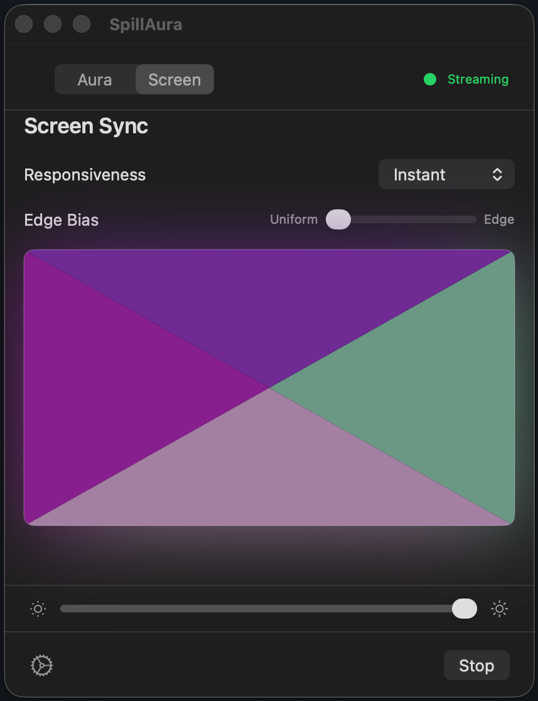
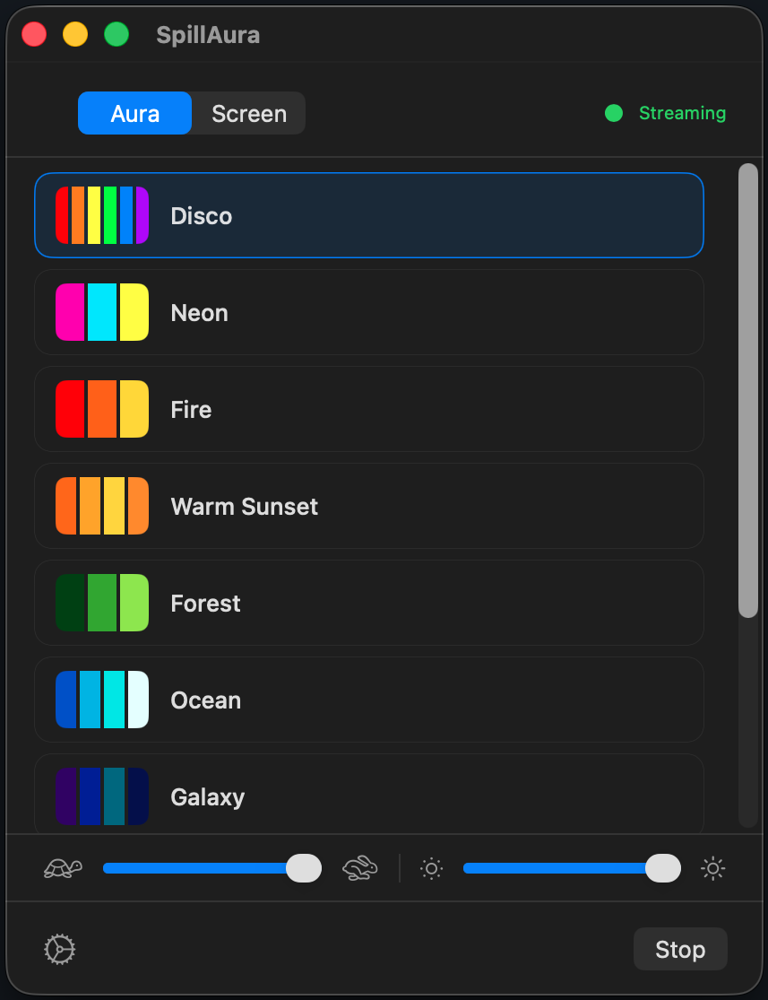
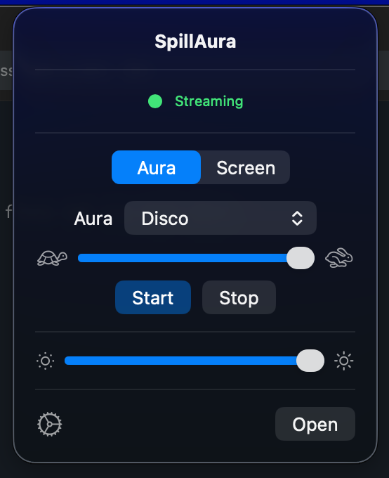

# SpillAura

A native macOS alternative to Philips Hue Sync — real-time screen color sync
and animated ambient lighting for your Hue lights.

  
  

## Why SpillAura

- Lightweight menu bar app — no Electron, no bloat
- Open-source and free
- Animated aura mode with 8 built-in palettes, independent of your screen
- Reliable streaming with automatic reconnection after sleep/wake

## Features

**Screen Sync** — captures your display in real-time and maps colors to your
lights using configurable screen zones. Assign lights to edges, corners, or
the full screen. Supports multiple monitors.

**Aura Mode** — animated color palettes that cycle through your lights
independently of screen content. Choose from 8 built-in auras or create your
own.

**Menu Bar Control** — lives in your menu bar for quick access. Switch modes,
pick auras, and adjust brightness without opening a window.

  

## Requirements

- macOS 14 or later
- Philips Hue Bridge (v2)
- Hue lights configured in an Entertainment Group

## Install

Download the latest `.dmg` from
[Releases](https://github.com/whatisboom/SpillAura/releases/latest),
open it, and drag SpillAura to your Applications folder.

## Setup

1. Open SpillAura — it discovers your bridge automatically via mDNS
2. Press the link button on your bridge when prompted
3. Grant Screen Recording permission when asked
   (System Settings → Privacy & Security → Screen Recording)
4. Pick a mode and press play

## Notes

- Entertainment Groups must be created in the official Hue app first
- Screen Recording permission is only needed for Screen Sync mode
